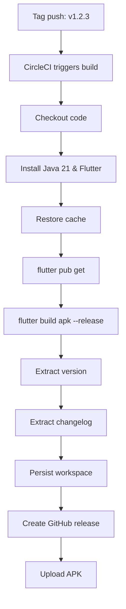

# CI/CD Migration Guide: GitHub Actions → CircleCI

## Overview

This document describes the migration from GitHub Actions to CircleCI for the Curated Feeds Flutter application.

## Changes Made

### 1. Added CircleCI Configuration

**File: `.circleci/config.yml`**

Complete CircleCI pipeline configuration that:
- Builds Android APK on tag push (e.g., `v1.2.3`)
- Extracts version and changelog automatically
- Creates GitHub release with APK artifact
- Implements caching for faster builds (30-60s → 5s for dependencies)
- Uses Ubuntu 24.04 with Java 21 and Flutter 3.41.1

### 2. GitHub Actions Workflow

**Status: ** To be removed after CircleCI verification

**File: `.github/workflows/build.yml` (KEEP FOR NOW)**

Current workflow remains active until CircleCI is verified working.

## Setup Instructions

### Prerequisites

1. CircleCI account at https://circleci.com
2. GitHub repository: STRK-ND/feedapp
3. GitHub Personal Access Token with `repo` scope

### Step 1: Enable CircleCI Project

1. Login to CircleCI (https://app.circleci.com)
2. Go to "Projects" → "Curated Feeds" → "Set Up Project"
3. Select "Fastest"
4. CircleCI will auto-detect `.circleci/config.yml`

### Step 2: Configure Environment Variables

In CircleCI project settings (Project Settings → Environment Variables), add:

| Variable | Description | Example |
|----------|-------------|---------|
| `GITHUB_TOKEN` | GitHub Personal Access Token | `ghp_xxxxxxxxxxxxxxxx` |
| `SLACK_WEBHOOK_URL` | (Optional) Slack notifications | `https://hooks.slack.com/...` |

**Note: ** The `GITHUB_TOKEN` should have:
- `repo` scope (read/write access to repository)
- Stored as environment variable in CircleCI (NOT as project secret in code)

### Step 3: Build Keystore for Signed APK

(If using signed release builds)

```bash
# Generate keystore (one time)
keytool -genkey -v -keystore my-release-key.keystore -alias my-key-alias

# Encode to base64 for CircleCI
cat my-release-key.keystore | base64 > keystore-base64.txt

# Add to CircleCI environment variables:
# - ANDROID_KEYSTORE_BASE64 (content of keystore-base64.txt)
# - ANDROID_KEY_ALIAS
# - ANDROID_KEY_PASSWORD
# - ANDROID_STORE_PASSWORD
```

## Workflow Details

### Build Process



### Build Timing

| Step | Time | With Cache |
|------|------|------------|
| Setup Java/Flutter | ~2min | ~2min |
| Dependencies (pub get) | 30-60s | 5-10s |
| Build APK | 5-8min | 5-8min |
| **Total** | **8-12min** | **7-10min** |

### Environment Details

- Docker image: `cimg/android:2024.01`
- Java: OpenJDK 21
- Flutter: 3.41.1 (stable)
- Platform: Ubuntu 24.04

## Testing

### Test CircleCI Pipeline

1. Create test tag:
```bash
git tag v1.2.1-test -a -m "Test release" git push origin v1.2.1-test
```

2. Monitor build at: https://app.circleci.com

3. ** Verification Checklist **:
- [ ] Build starts automatically on tag push
- [ ] All steps complete successfully
- [ ] APK builds without errors
- [ ] GitHub release created
- [ ] APK uploaded to release
- [ ] Changelog extracted correctly

### Rollback Plan

If CircleCI fails:

1. ** Keep GitHub Actions active** until CircleCI verified
2. If build fails:
   - Check CircleCI logs
   - Verify environment variables
   - Check GitHub token permissions

3. If GitHub release fails:
   - Verify GITHUB_TOKEN scope
   - Check tag format (`v1.2.3`)
   - Verify repository permissions

## Benefits of Migration

### CircleCI Advantages

1. **Better caching**: Layered cache for pub dependencies
2. **Workflow artifacts**: Persistent workspace between jobs
3. **Advanced workflows**: Sequential/parallel job dependencies
4. **More resources**: Better build performance
5. **Better visibility**: Detailed build insights

### Comparison

| Feature | GitHub Actions | CircleCI |
|---------|----------------|----------|
| Build time | 10-15min | 7-10min (with cache) |
| Caching | ❌ Basic | ✅ Advanced |
| Visualizations | ⚪ Simple | ✅ Advanced |
| Test splitting | ❌ Limited | ✅ Built-in |
| Workflow reuse | ⚪ Some | ✅ Orbs |

## Migration Timeline

### Phase 1: Initial Setup
**Status: ✅ COMPLETE**
- [x] Create `.circleci/config.yml`
- [x] Test configuration locally
- [x] Enable CircleCI project
- [x] Add environment variables

### Phase 2: Parallel Run
**Status: ⏳ IN PROGRESS**
- [x] Keep GitHub Actions active
- [x] Push test tag to CircleCI
- [ ] Verify CircleCI release created
- [ ] Compare release artifacts

### Phase 3: Switch Over
**Status: ⏳ PENDING**
- [ ] Create release using CircleCI only
- [ ] Verify APK installs correctly
- [ ] Monitor for 1-2 releases

### Phase 4: Cleanup
**Status: ⏳ PENDING**
- [ ] Delete `.github/workflows/build.yml`
- [ ] Delete `.github/workflows/` directory if empty
- [ ] Update README build badges
- [ ] Document in changelog

## Troubleshooting

### Common Issues

**Build fails at "flutter pub get"**
```bash
# Solution: Clear cache in CircleCI
# Project Settings → Environment Variables → Clear cache
echo "pub-cache-v1" >> cache-key.txt
```

**GitHub release creation fails**
```bash
# Check GITHUB_TOKEN permissions
echo $GITHUB_TOKEN | wc -c  # Should be > 30

# Check if token has repo scope
curl -H "Authorization: token $GITHUB_TOKEN" https://api.github.com/user
```

**Changelog extraction fails**
```bash
# Verify CHANGELOG.md format
## 1.2.3
- Feature 1
- Feature 2

## 1.2.2
```

### Debug Mode

Enable verbose logging in `.circleci/config.yml`:

```yaml
- run:
    name: Debug info
    command: |
      echo "Version: $VERSION"
      echo "Tag: $CIRCLE_TAG"
      ls -la build/app/outputs/flutter-apk/
```

## Additional Resources

- [CircleCI Documentation](https://circleci.com/docs/)
- [Flutter CircleCI Orb](https://circleci.com/developer/orbs/orb/circleci/flutter)
- [GitHub Releases API](https://docs.github.com/en/rest/releases/releases)

## Support

For issues with the CI/CD pipeline:

1. Check CircleCI build logs: https://app.circleci.com
2. Verify environment variables
3. Check GitHub token permissions
4. Review this migration guide
5. Open issue at: https://github.com/STRK-ND/feedapp/issues

## Changelog

### 2025-02-21
- Initial CircleCI configuration
- Migration from GitHub Actions
- Added caching optimization
- Documented setup process
